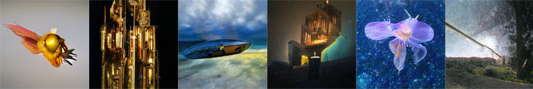

# Syllabus and materials

(*Images created using [GanBreeder](https://ganbreeder.app/)*)

Here's all you needed for your first few weeks of creative AI and ML experiments, with supplementary materials to support further learning.

## Before the course
* [Prerequisites](Prerequisites.md). Make sure you go through these before the course.

## Lectures
The lessons each include an online document with key insights and exercises, augmented with lecture slides and notes with more details. The lectures primarily utilize image processing examples (more suitable for lecture slides) and audio applications are covered in the exercises.

Day 1:
* [Introduction and motivation](Intro.md). Why one should rather co-create than compete with AI technology.
* [Neural networks, part 1](NeuralNetworks1.md). Basics of neural networks, focusing on discriminative models like image classification.
* [Tools and frameworks.](GettingStarted.md) Getting started with practical AI coding, understanding the strengths and weaknesses of frameworks like Tensorflow, Pytorch, and ml5js.

Day 2:
* [Neural networks, part 2](NeuralNetworks2.md). From discriminative to generative models like GANs. How to imbue computers with audiovisual imagination?
* [Audio exercises, part 1](Audio.md).

Day 3:
* [Neural networks, part 3](NeuralNetworks3.md). Sequential problems like text prediction and generation.
* [Audio exercises, part 2](Audio2.md)

Day 4:
* [Optimization, part 1](Optimization.md). Pretty much all AI and ML is some form of (mathematical) optimization. We've already applied it when training neural networks; now it's the time to get a bit wider and deeper understanding. This first part deals with continuous-valued problems.

Day 5:
* [Optimization, part 2](Optimization.md). The second part expands to discrete and sequential problems like deep reinforcement learning for game AI.

## Inspiration for further experiments
*a.k.a. Heroes of Creative AI and ML coding*

What to do with the skills and knowledge you gain on the course? Here are some people who are mixing AI, machine learning, art, and design with awesome results:

* http://otoro.net/ml/
* http://genekogan.com/
* http://quasimondo.com/
* http://zach.li/

## Supplementary material
* [ml5js](https://ml5js.org/) & [p5js](http://p5js.org/), the toolset that provides the fastest way to creative AI coding in a [browser-based editor](https://editor.p5js.org), without installing anything. Works even on mobile browsers! [This example](https://editor.p5js.org/AndreasRef/sketches/r1_w73FhQ) uses a deep neural network to track your nose and draw on the webcam view. [This one](https://editor.p5js.org/genekogan/sketches/Hk2Q4Sqe4) utilizes similar PoseNet tracking to control procedural audio synthesis.

* [Machine Learning for Artists (ml4a)](http://ml4a.github.io/), including many cool [demos](http://ml4a.github.io/demos/), many of them built using p5js and ml5js.  

* [Unity Machine Learning Agents](https://github.com/Unity-Technologies/ml-agents), a framework for using deep reinforcement learning for Unity. Includes code examples and blog posts.

* [Two Minute Papers](https://www.youtube.com/playlist?list=PLujxSBD-JXglGL3ERdDOhthD3jTlfudC2), a YouTube channel with short and accessible explanations of AI and deep learning research papers.

* [3Blue1Brown](https://www.youtube.com/channel/UCYO_jab_esuFRV4b17AJtAw), a YouTube channel with excellent visual explanations on math, including [neural networks](https://www.youtube.com/playlist?list=PLZHQObOWTQDNU6R1_67000Dx_ZCJB-3pi) and [linear algebra](https://www.youtube.com/playlist?list=PLZHQObOWTQDPD3MizzM2xVFitgF8hE_ab).

* [Game AI Book](http://gameaibook.org/) by Togelius and Yannakakis. PDF available.

* [Deep Learning book](https://www.deeplearningbook.org/) by Goodfellow et al. An excellent resource for digging deeper, for those that can handle some linear algebra, probability, and statistics. PDF available.

## Links
**The field is changing rapidly and this course is constantly evolving. We will keep adding relevant resources and materials below, gradually incorporating them to the lectures as well.** Thus, if you want to stay updated, check back at this page every now and then.

[Back to course home](../README.md)
