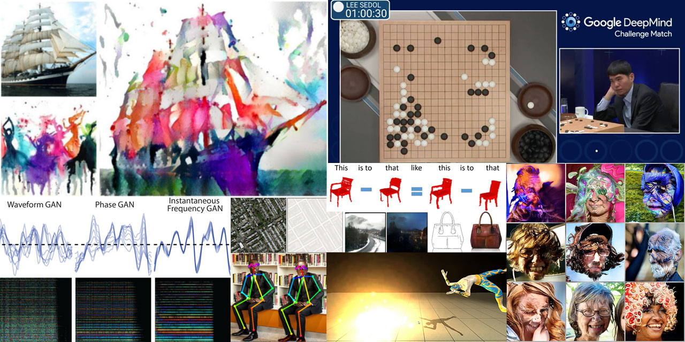

# AI for Media, Art & Design (Aka "Intelligent Computational Media")

<!--

-->

This repository contains the lectures and materials of Aalto University's Intelligent Computational Media course.

Follow the course's [Twitter feed](https://twitter.com/aaltomediaai) for links and resources.

## Course Overview & Design Philosophy

This is a hands-on, project-based crash course for deep learning and other AI techniques for people with **as little technical prerequisites as possible.** The focus is on **media processing and games**, which makes this particularly suitable for **artists and designers**.

The 2024 edition of this course is taught during Aalto University's Period 3 (six weeks) by **Prof Perttu Hämäläinen**  ([Twitter](https://twitter.com/perttu_h)) and **Nam Hee Gordon Kim.** ([Twitter](https://twitter.com/NamHeeGordonKim)). Registeration through [Aalto's Mycourses system](https://mycourses.aalto.fi), specific inquiries to: perttu.hamalainen[at]aalto.fi (but check the info below first).

### Learning Goals

The goal is for students to:

- understand how common AI algorithms & tools work,
- understand what the tools can be used for in context of art, media, and design, and
- get hands-on practice of designing, implementing and/or using the tools.

### Materials and pedagogical approach

The course is taught through:

- Lectures
- Exercises that require you to either practice using existing AI tools, programmatically utilize the tools (e.g., to automate tedious manual prompting), or build new systems. We always try to provide both easy and advanced exercises to cater for different skill levels.
- Final project on topics based on each student's interests. This can also be done in pairs.  

The exercises and project work are designed to scale for a broad range of skill levels and starting points.

Outside lectures and exercises, we use **Teams** for sharing results and peer-to-peer tutoring and guidance (Teams invitation will be send to registered students).

### Student Prerequisites

Although many of the exercises do require some Python programming and math skills, one can complete the course without programming, by focusing on creative utilization of existing tools such as ChatGPT and DALL-E.

### Grading / Project Work

You **pass the course** by submitting a report of your project in [MyCourses](http://mycourses.aalto.fi). The grading is pass / fail, as numerical grading is not feasible on a course where students typically come from very different backgrounds. To get your project accepted, the main requirement is that a you make an effort and advance from your individual starting point.

It is also recommended to make the project publicly available, e.g., as a Colab notebook or Github repository. Instead of a project report, you may simply submit a link to the notebook or repository, if they contain the needed documentation.

Students can choose their **project topics** based on their own interests and learning goals. Projects are agreed on with the teachers. You could create something in Colab or Unity Machine Learning agents, or if you'd rather not write any code, experimenting with artist-friendly tools like [GIMP-ML](https://github.com/kritiksoman/GIMP-ML) or [RunwayML](https://runwayml.com/) to create something new and/or interesting is also ok. For example, one could generate song lyrics using a text generator such as GPT-3, and use them to compose and record a song.

## Before the Course

Make sure you go through the materials and instructions on [this page](https://github.com/PerttuHamalainen/MediaAI/blob/master/Lessons/Prerequisites.md) before the course. This will take about 2 hours, plus an extra 1-2 hours if you install all the software on your computer.

The programming exercises are in the form of Jupyter notebooks (links: scroll down), and the exercise links open the notebooks in [Google Colab](https://colab.research.google.com/notebooks/intro.ipynb#), for which you need a Google account.

Since most of the exercises are in Python, these [Python learning resources](Lessons/Python.md) might come handy. However, if you know some other programming language, you should be able to learn while going through the exercises.

For using OpenAI tools, it's also good to get an [OpenAI account](https://platform.openai.com). When creating the account, you get some free quota for generating text and images.

## Contents

**Overview and Motivation:**

- Lecture: [Overview and motivation](Lessons/LectureSlides/course_intro.pdf). Why one should rather co-create than compete with AI technology.
- Exercise: Each student joins the class Teams and posts an introduction to the General channel: What's your background, what do you want to learn? This will help students to find teammates and teachers to customize the course contents

Programming exercises for those with at least some programming background:
- Exercise: If you didn't already do it, go through the Colab learning links in the [course prerequisites](https://github.com/PerttuHamalainen/MediaAI/blob/master/Lessons/Prerequisites.md).
- Exercise: Introduction to tensors, numpy and matplotlib through processing images and audio. [[Open in Colab]](http://colab.research.google.com/github/PerttuHamalainen/MediaAI/blob/master/Code/Jupyter/ImagesAndAudio.ipynb), [[Solutions]](http://colab.research.google.com/github/PerttuHamalainen/MediaAI/blob/master/Code/Jupyter/ImagesAndAudio_solutions.ipynb)
- Related to the above, see also: [https://numpy.org/devdocs/user/absolute_beginners.html](https://numpy.org/devdocs/user/absolute_beginners.html)
- Exercise: Continuing the Numpy introduction, now for a simple data science project. [[Open in Colab]](http://colab.research.google.com/github/PerttuHamalainen/MediaAI/blob/master/Code/Jupyter/DataAndTensors.ipynb), [[Solutions]](http://colab.research.google.com/github/PerttuHamalainen/MediaAI/blob/master/Code/Jupyter/DataAndTensors_solutions.ipynb).
- Exercise: Training a very simple neural network using a [Kaggle](https://www.kaggle.com/) dataset of human height and weight. [[Open in Colab]](http://colab.research.google.com/github/PerttuHamalainen/MediaAI/blob/master/Code/Jupyter/PredictWeight.ipynb), [[Solutions]](http://colab.research.google.com/github/PerttuHamalainen/MediaAI/blob/master/Code/Jupyter/PredictWeight_solutions.ipynb)

For those with no programming background, this is a good time to think about your project and, e.g, browse the [Course Twitter](https://twitter.com/aaltomediaai) for inspiration. Or you might skip ahead to text generation exercises.

**Text Generation & Co-writing with AI:**

- Lecture: [Co-writing with AI](Lessons/LectureSlides/Writing_with_AI.pdf). Introduction to Large Language Models (LLMs), some history, examples of different types of texts and applications.
- Exercises: [Generating game ideas, automating manual prompting using Python, Retrieval-Augmented Generation](Lessons/LectureSlides/Writing_with_AI_exercises.pdf)

**Image Generation**
- Materials coming up...
- Prompting Exercise: Prompt images with different art styles, cameras, lighting... For reference, see [The DALL-E 2 prompt book](https://dallery.gallery/wp-content/uploads/2022/07/The-DALL%c2%b7E-2-prompt-book.pdf) Use your preferred text-to-image tool such as DALL-E, MidJourney or Stable Diffusion. You can install Stable Diffusion locally, and it is also available through Colab: [Huggingface basic notebook](https://colab.research.google.com/github/huggingface/notebooks/blob/main/diffusers/stable_diffusion.ipynb), [Notebook with Automatic1111 WebUI](https://colab.research.google.com/github/TheLastBen/fast-stable-diffusion/blob/main/fast_stable_diffusion_AUTOMATIC1111.ipynb), [Notebook with Foocus UI, including a face swap function for consistent character generation](https://colab.research.google.com/github/lllyasviel/Fooocus/blob/main/fooocus_colab.ipynb). If you prefer a mobile app, some free options are Microsoft Copilot for ChatGPT and DALL-E on [iOS](https://apps.apple.com/us/app/microsoft-copilot/id6472538445) or [Android](https://apps.apple.com/us/app/microsoft-copilot/id6472538445), or [Draw Things for Stable Diffusion](https://drawthings.ai/)
- Prompting Exercise: Pick an interesting reference image and try to come up with a text prompt that produces an image as close to the reference as possible. This helps you hone your descriptive English writing skills.
- Prompting Exercise: Practice using both text and image prompts using StableDiffusion and ControlNet. This can be done either in [Colab](https://colab.research.google.com/github/huggingface/notebooks/blob/main/diffusers/controlnet.ipynb#scrollTo=4_lkdXOQmjnV), installing Stable Diffusion locally and using an UI such as [Comfy UI](https://comfyanonymous.github.io/ComfyUI_examples/controlnet/) or [Foocus](https://github.com/lllyasviel/Fooocus), or using a mobile app such as [Draw Things](https://drawthings.ai/) 
- Prompting Exercise: Make your own version of [making a bunny happier](https://www.reddit.com/r/ChatGPT/comments/1839fgo/asking_gpt_to_make_a_bunny_happier/), progressively exaggerating some other aspect of some initial prompt.
- Colab Exercise: Using a Pre-Trained Generative Adversarial Network (GAN) to generate and interpolate images. [[Open in Colab]](https://colab.research.google.com/github/PerttuHamalainen/MediaAI/blob/master/Code/Jupyter/BigGAN%20test.ipynb), [[Solutions]](https://colab.research.google.com/github/PerttuHamalainen/MediaAI/blob/master/Code/Jupyter/BigGAN%20test_solutions.ipynb)
- Colab Exercise: [Interpolate between prompts using Stable Diffusion](https://colab.research.google.com/github/keras-team/keras-io/blob/master/examples/generative/ipynb/random_walks_with_stable_diffusion.ipynb)
- Colab Exercise: Finetune StableDiffusion using your own images. There are multiple options, although all of them seem to require at least 24GB of GPU memory => you'll most likely need a paid Colab account. Some options: [Huggingface Diffusers official tutorial](https://colab.research.google.com/github/huggingface/notebooks/blob/main/diffusers/sd_dreambooth_training.ipynb), [Joe Penna's DreamBooth](https://github.com/JoePenna/Dreambooth-Stable-Diffusion), [TheLastBen](https://github.com/TheLastBen/fast-stable-diffusion)

**Audio Generation**
- Materials coming soon

**Animation and Movement Control**
- Materials coming soon

**Foundation models and other common building blocks**
- Materials coming soon

**Training Neural Networks from Scratch**

- Lecture: [Neural Networks: Tools and Principles, Part 1](Lessons/LectureSlides/neural_networks_part1.pdf)
- Demos:
  * [Demo 1: Inference](https://github.com/PerttuHamalainen/MediaAI/blob/master/Lessons/Demos/demo1-inference.ipynb)
  * [Demo 2: Training](https://github.com/PerttuHamalainen/MediaAI/blob/master/Lessons/Demos/demo2-training.ipynb)
  * [Demo 3: Denoising CNN Autoencoder](https://github.com/PerttuHamalainen/MediaAI/blob/master/Lessons/Demos/demo3-denoising-cnn-autoencoder.ipynb)
- Exercise: Image classification. [[Open in Colab]](http://colab.research.google.com/github/PerttuHamalainen/MediaAI/blob/master/Code/Jupyter/MNIST.ipynb), [[Solutions]](http://colab.research.google.com/github/PerttuHamalainen/MediaAI/blob/master/Code/Jupyter/MNIST_solutions.ipynb)

**Deeper into Transformers**
- Materials coming soon

**Optimization**

- Lecture: [Optimization](Lessons/LectureSlides/optimization.pdf). Mathematical optimization is at the heart of almost all AI and ML. We've already applied optimization when training neural networks; now it's the time to get a bit wider and deeper understanding. We'll cover a number of common techniques such as Deep Reinforcement Learning (DRL) and Covariance Matrix Adaptation Evolution Strategy (CMA-ES).
- Exercise: Experiment with abstract art generation using [CLIPDraw](https://colab.research.google.com/github/kvfrans/clipdraw/blob/main/clipdraw.ipynb) and [StyleCLIPDraw](https://colab.research.google.com/github/pschaldenbrand/StyleCLIPDraw/blob/master/Style_ClipDraw.ipynb). First, follow the notebook instructions to get the code to generate something. Then try different text prompts and different drawing parameters.
- Exercise (hard, optional): Modify CLIPDraw or StyleCLIPDraw to use CMA-ES instead of Adam. This should allow more robust results if you use high abstraction (only a few drawing primitives), which tends to make Adam more probable to get stuck in a bad local optimum. For reference, you can see this old course exercise on [Generating abstract adversarial art using CMA-ES](http://colab.research.google.com/github/PerttuHamalainen/MediaAI/blob/master/Code/Jupyter/CMA-ES_Art.ipynb). Note: You can also combine CMA-ES and Adam by first finding an approximate solution with CMA-ES and then finetuning with Adam.
- Unity exercise (optional): [Discovering billiards trick shots in Unity](Code/Unity/IntelligentPool). Download the project folder and test it in Unity.

**Game AI**

- Lecture: [Game AI](Lessons/LectureSlides/game_AI.pdf) What is game AI? Game AI Research in industry / academia. Core areas of videogame AI. Deep Dive: State-of-the-art AI playtesting (Roohi et al., 2021): Combining deep reinforcement learning (DRL), Monte-Carlo tree search (MCTS) and a player population simulation to estimate player engagement and difficulty in a match-3 game.
- Exercise: Deep Reinforcement Learning for General Game-Playing [[Open in Colab]](http://colab.research.google.com/github/PerttuHamalainen/MediaAI/blob/master/Code/Jupyter/GameAI.ipynb). [[Open in Colab with Solutions]](http://colab.research.google.com/github/PerttuHamalainen/MediaAI/blob/master/Code/Jupyter/GameAI_Solutions.ipynb).

### Colab/Jupyter Notebooks and Other Tools

These can provide starting points for your project work. Note: the notebooks may take a while to run, but you can usually view or listen the pre-generated results without running the code. Disclaimer: I haven't had time to check that all of these run properly.

NOTE: if you get weird errors when running these on Colab, try adding `%tensorflow_version 1.x` to the beginning of the notebook, then select "Restart and run all" from the Runtime menu. Colab recently switched to Tensorflow 2 by default, but many of these notebooks precede the switch.

- [StyleGAN 2 finetuned with paintings](https://colab.research.google.com/drive/1cFKK0CBnev2BF8z9BOHxePk7E-f7TtUi#forceEdit=true&sandboxMode=true&scrollTo=jJRPjAU3Tn-K). Also see the [Reddit thread](https://www.reddit.com/r/MachineLearning/comments/bagnq6/p_stylegan_trained_on_paintings_512x512/?utm_content=title&utm_medium=post_embed&utm_name=44df278f7cb542cdb847cad34267b5ff&utm_source=embedly&utm_term=bagnq6)
- [Generate piano music with transformer networks](https://colab.research.google.com/notebooks/magenta/piano_transformer/piano_transformer.ipynb)
- [GPT-2 text generation and finetuning the model with custom text](https://colab.research.google.com/drive/1VLG8e7YSEwypxU-noRNhsv5dW4NfTGce)
- [NSynth Neural Audio Synthesis](https://colab.research.google.com/notebooks/magenta/nsynth/nsynth.ipynb). This is the "official" tutorial by Google.
- [A more extensive NSynth notebook](https://colab.research.google.com/drive/10wogut1V2ToGQZJcXH8StoMat6oWxoEu#scrollTo=0Fy4k_7SrnjH).
- [Neural style transfer for images](https://colab.research.google.com/github/tensorflow/lucid/blob/master/notebooks/differentiable-parameterizations/style_transfer_2d.ipynb)
- [Style transfer for textured 3D models](https://colab.research.google.com/github/tensorflow/lucid/blob/master/notebooks/differentiable-parameterizations/style_transfer_3d.ipynb)
- [BigGAN with an interactive interface](https://colab.research.google.com/github/tensorflow/hub/blob/master/examples/colab/biggan_generation_with_tf_hub.ipynb)
- [A big Github repository of Jupyter notebooks for various topics, e.g., text, voice, visualization](https://github.com/firmai/awesome-google-colab). To open the notebooks in Colab, replace the [https://github.com](https://github.com/) in the urls by [https://colab.research.google.com/github](https://colab.research.google.com/github).
- [12 Colab notebooks that matter](https://towardsdatascience.com/12-colab-notebooks-that-matter-e14ce1e3bdd0).
- [Google AI Hub notebooks](https://aihub.cloud.google.com/s?category=notebook&order=3)
- [Pix2Pix example](https://colab.research.google.com/github/tensorflow/docs/blob/master/site/en/tutorials/generative/pix2pix.ipynb#scrollTo=ITZuApL56Mny)
- A large repository of Jupyter notebook implementations of deep learning models (may or may not work on Colab): [https://github.com/rasbt/deeplearning-models](https://github.com/rasbt/deeplearning-models)
- [Deepfake tools](https://vuild.com/deep-fake-tools) (face swapping for images and video)
- [Machine learning plugins for GIMP](https://github.com/kritiksoman/GIMP-ML)

### Inspiration for Further Experiments

*a.k.a. Heroes of Creative AI and ML coding*

Here are some people who are mixing AI, machine learning, art, and design with awesome results:

- [http://otoro.net/ml/](http://otoro.net/ml/)
- [http://genekogan.com/](http://genekogan.com/)
- [http://quasimondo.com/](http://quasimondo.com/)
- [http://zach.li/](http://zach.li/)
- [http://memo.tv](http://memo.tv)
- [https://www.enist.org](https://www.enist.org/post/)

### Supplementary Material

- [ml5js](https://ml5js.org/) & [p5js](http://p5js.org/), the toolset that provides the fastest way to creative AI coding in a [browser-based editor](https://editor.p5js.org/), without installing anything. Works even on mobile browsers! [This example](https://editor.p5js.org/AndreasRef/sketches/r1_w73FhQ) uses a deep neural network to track your nose and draw on the webcam view. [This one](https://editor.p5js.org/genekogan/sketches/Hk2Q4Sqe4) utilizes similar PoseNet tracking to control procedural audio synthesis.
- [Machine Learning for Artists (ml4a)](http://ml4a.github.io/), including many cool [demos](http://ml4a.github.io/demos/), many of them built using p5js and ml5js.
- [Unity Machine Learning Agents](https://github.com/Unity-Technologies/ml-agents), a framework for using deep reinforcement learning for Unity. Includes code examples and blog posts.
- [Two Minute Papers](https://www.youtube.com/playlist?list=PLujxSBD-JXglGL3ERdDOhthD3jTlfudC2), a YouTube channel with short and accessible explanations of AI and deep learning research papers.
- [3Blue1Brown](https://www.youtube.com/channel/UCYO_jab_esuFRV4b17AJtAw), a YouTube channel with excellent visual explanations on math, including [neural networks](https://www.youtube.com/playlist?list=PLZHQObOWTQDNU6R1_67000Dx_ZCJB-3pi) and [linear algebra](https://www.youtube.com/playlist?list=PLZHQObOWTQDPD3MizzM2xVFitgF8hE_ab).
- [Elements of AI](https://www.elementsofai.com/), an online course by University of Helsinki and Reaktor. Aalto students can also get 2 credits for this course. This is a course about the basic concepts, societal implications etc., no coding.
- [Game AI Book](http://gameaibook.org/) by Togelius and Yannakakis. PDF available.
- [Deep Learning book](https://www.deeplearningbook.org/) by Goodfellow et al. An excellent resource for digging deeper, for those that can handle some linear algebra, probability, and statistics. PDF available.

### Comparison to other courses

Gene Kogan's NYU course [Neural Aesthetics](https://ml4a.github.io/classes/itp-F18/):

- This course covers similar content as Kogan’s excellent course, but run over 3 weeks with intensive sessions from 9am to 12am, Tuesday-Friday, according to Aalto Media Lab's usual study schedule. This is thus more of a short crash course, and students willing to learn more should definitely check out Kogan's course as well.
- More content on games, as much of the content is inherited from the [Computational Intelligence in Games](https://version.aalto.fi/gitlab/hamalap5/CIGCourse2018) course by Perttu Hämäläinen (Spring 2018, now replaced by this course)

[Machine Learning: Basic Principles](https://mycourses.aalto.fi/course/view.php?id=20569) at Aalto CS:

- We have some similar exercises, but the focus is more on applications and less on theory and mathematics, in order to make the material accessible for a wider audience. The more mathematically inclined students are highly encouraged to take both courses.

[Special Course in Computer Science D: Seminar on Computational Creativity](https://mycourses.aalto.fi/course/view.php?id=30459) at Aalto CS/ARTS:

- We focus on specific algorithms and their application, while this seminar focusses on theoretical questions regarding what makes a computational system creative, e.g. the very definition of creativity, means of evaluating creative systems, and the role of autonomy and intentionality. These questions are highly relevant to this course too, and we consequently provide a Computational Creativity crash course lecture on the last day of teaching.

[Elements of AI](https://www.elementsofai.com/):

- We have more practical exercises; this is a good follow-up if you've already taken that course.

### Updates

*The field is changing rapidly and we are constantly collecting new teaching material.*

Follow the course's [Twitter feed](https://twitter.com/aaltomediaai) to stay updated. The twitter works as a public backlog of material that is used when updating the lecture slides.
